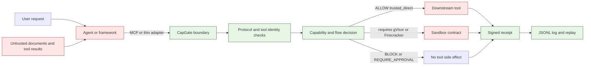
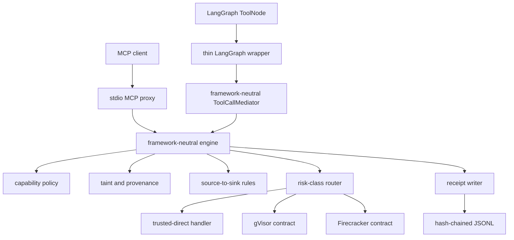
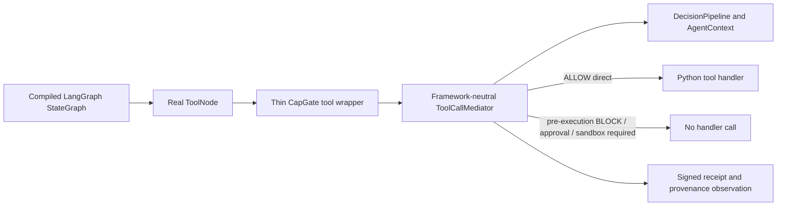

# CapGate project guide

This guide explains CapGate from first principles. It is written for a software engineer who can
read Python but is new to AI-agent security, information-flow control, and the Model Context
Protocol (MCP).

CapGate is a **research prototype**, not a production security boundary. The parts described as
working are backed by local code and tests. The parts described as contracts, designs, or future
work must not be presented as completed guarantees.

Useful companion documents:

- [README](README.md) — the short portfolio-facing introduction and quick start;
- [current status](STATUS.md) — the precise implemented/partial/unmeasured claim boundary;
- [security model](docs/SECURITY_MODEL.md) — the formal assets, attacker, trust boundary, invariants,
  and residual risks;
- [learning path](docs/LEARNING_PATH.md) — focused exercises and mastery questions;
- [Stage 1 taint design](spec-docs/STAGE1_TAINT_DESIGN.md) and
  [Stage 2 isolation design](docs/design-notes/STAGE2_ISOLATION.md); and
- [security policy](SECURITY.md) — safe research and vulnerability-reporting expectations.

## 1. The project in one minute

An AI agent can read data and call tools. A prompt injection becomes dangerous when untrusted data
influences an agent that can also reach private information and perform an external action. For
example:

1. the agent reads an untrusted email;
2. the email contains an instruction to find a private document;
3. the agent reads that document; and
4. the agent sends its contents to an external address.

Trying to perfectly recognize the malicious sentence is not CapGate's primary strategy. CapGate
assumes the model may already be confused or compromised. It places a deterministic enforcement
layer at the tool boundary and asks questions normal software can answer:

- Is this agent allowed to use this capability?
- Where did the data feeding this call come from?
- Is private data influenced by an untrusted source?
- Is the destination an external or otherwise dangerous sink?
- Must this tool run in a particular isolation backend?
- Can the action and decision be recorded without storing the raw secret?

If a required check fails or cannot be performed, secure mode blocks the call.

### What CapGate is

CapGate is a Python security mediator for AI-agent tool calls. Its primary integration is a stdio
MCP JSON-RPC proxy. Its security logic is framework-neutral so that a thin adapter can also mediate
tool calls from frameworks such as LangGraph.

The current prototype contains:

- strict MCP request, response, and supported-method validation;
- deny-by-default capability policy;
- confidentiality, integrity, and provenance labels;
- static source-to-sink rules and a lethal-trifecta rule;
- tool discovery, definition pinning, and shadow-name checks;
- deterministic risk-class routing contracts for direct, gVisor, and Firecracker execution;
- bounded egress, resource-budget, and dual-model quarantine contracts;
- Ed25519-signed, hash-chained action receipts and replay;
- an offline MCP security demo; and
- a narrow offline LangGraph integration slice with no LLM.

### What CapGate is not

CapGate does **not** currently establish:

- that prompt injection has been prevented or detected;
- representative AgentDojo attack-success or utility results;
- robustness against an adaptive attacker;
- real process, filesystem, syscall, network, container, or VM isolation;
- a production gVisor runner, Firecracker lifecycle, or egress broker;
- a live dual-model provider flow;
- broad framework compatibility beyond the tested LangGraph slice;
- safe production handling of real credentials or sensitive data; or
- production readiness or a formal end-to-end security proof.

No external model, provider API, employer system, or third-party target is needed to understand or
run the deterministic demonstrations in this repository.

## 2. The threat model

A threat model says what the system protects, what the attacker may control, and what must remain
trusted. Without those boundaries, a statement such as “secure” has no precise meaning.

### Assets to protect

CapGate is designed around these assets:

- private tool data, such as files, email, database records, or credentials;
- the ability to perform side effects, such as sending, writing, paying, or executing;
- the host, filesystem, network, and other sessions;
- policy and tool-security metadata;
- the receipt signing key and receipt history; and
- the integrity of the decision and audit trail.

### What may be hostile

The design assumes that any of the following may be malicious, malformed, or simply wrong:

- model output and generated tool arguments;
- web pages, email bodies, uploaded files, RAG content, and MCP tool results;
- MCP tool descriptions and schemas after their first trusted observation;
- downstream JSON-RPC messages;
- a tool process or generated program routed to a sandbox;
- network names, DNS answers, redirects, paths, query strings, and bodies; and
- a model's claim that an action is safe.

This is deliberately stronger than “the user typed a bad prompt.” Indirect prompt injection arrives
inside data the user asked the agent to process.

### What is trusted today

The current trusted computing base includes:

- CapGate's Python process and enforcement code;
- the operator-supplied capability policy and tool metadata;
- the receipt signer, private key, and local state directory;
- the host OS and Python runtime;
- the person who selects downstream servers and trusted-direct tools; and
- for any future isolation claim, the real Linux host, selected runtime, pinned images, and egress
  broker.

The downstream MCP process is launched on the host by the current CLI. That process is **not**
contained merely because individual calls pass through CapGate.

### Trust-boundary picture



The colors show the intended reasoning boundary, not a claim that the current host provides real
process isolation.

## 3. Essential terms

| Term | Plain-English meaning |
|---|---|
| Agent | Software that uses a model or deterministic planner to choose actions and tools. |
| Tool | A callable operation such as reading a file, searching, sending email, or writing a record. |
| MCP | Model Context Protocol, a protocol used by clients and servers to advertise and call tools. |
| JSON-RPC | The request/response envelope used by the stdio MCP path in this project. |
| Capability | A specific permission written as `action:resource`, such as `read:private` or `send:external`. |
| Policy | The operator's explicit `can`, `cannot`, and `requires_approval` capability rules. |
| Taint label | Metadata describing a value's confidentiality, integrity, and origins. It does not change the value itself. |
| Provenance | Where data came from and which prior result influenced a new call. |
| Source | A data origin, such as a secret store, untrusted web page, email, or tool result. |
| Sink | A destination with security impact, such as an external network call, email, shell, payment, or database write. |
| Information-flow control | Deciding whether data with a particular label may flow to a particular sink. |
| Lethal trifecta | Private data, untrusted influence, and external communication on one path. CapGate blocks that combination. |
| Fail-closed | If a required security decision cannot be completed safely, block instead of allowing. |
| Deny by default | A capability is blocked unless an explicit rule allows it. |
| Risk class | Trusted metadata choosing direct execution, gVisor, or Firecracker routing. |
| Tool pin | A stored hash of a tool's name, description, and input schema used to detect later changes. |
| TOFU | Trust on first use: the first observed definition becomes the baseline. |
| Receipt | A signed record containing the decision, hashes, labels, sequence, and previous-receipt hash. |
| Replay | Loading receipts in order and verifying sequence, chaining, schemas, and signatures. |
| Rule ID | A stable machine-readable explanation such as `flow.lethal_trifecta`. |

## 4. Architecture

CapGate uses a hub-and-spoke design. The decision engine is the hub. MCP and LangGraph are integration
spokes. Security rules belong in the hub, not in each adapter.



The important separation is:

- **Transport and framework adapters** translate calls.
- **The engine** decides.
- **Execution code** performs only allowed calls through the required route.
- **The receipt layer** records what happened without storing raw arguments or results.

### Current implementation level

| Area | Current level |
|---|---|
| MCP stdio proxy | Working locally for the supported line-delimited JSON-RPC surface. |
| Capability and flow engine | Working locally with deterministic unit/integration coverage. |
| Signed receipts and replay | Working locally for retained logs and keys. |
| Persistent tool-definition pinning | Working locally with SQLite and TOFU limitations. |
| LangGraph | Real, narrow `StateGraph`/`ToolNode` slice with a thin wrapper and no LLM; not broad framework support. |
| gVisor/Firecracker | Request contracts and injected-runner tests only; no real isolation claim. |
| Egress and budgets | Pure policy/accounting components; not wired as a production broker. |
| Dual-model quarantine | Provider-independent boundary tests only; no live provider or trusted resolver. |
| AgentDojo | Harness and historical wiring artifacts; no representative defense result. |

## 5. One MCP request from start to finish

The main runtime path begins at [`capgate proxy`](src/capgate/cli.py), enters the stdio server in
[`proxy/server.py`](src/capgate/proxy/server.py), and is handled by
[`ProxySession`](src/capgate/proxy/session.py).

### Step 1: start the proxy

The CLI loads both the capability policy and tool metadata. Supplying one without the other is an
error. It creates or loads an Ed25519 key, opens the JSONL receipt store and SQLite pin store, starts
the downstream MCP process, and creates one proxy session.

Starting without both policy and metadata selects the Stage 0 pass-through/debug path. That mode is
useful for transport development and baseline work, but it is not a security control.

### Step 2: discover tools

Before a secure-mode call may execute, the client sends `tools/list`.

1. [`events.py`](src/capgate/proxy/events.py) checks the JSON-RPC version, ID type, exact supported
   fields, params shape, and cursor type.
2. The proxy clears the previously accepted tool set before asking downstream. A failed refresh
   cannot leave stale accepted tools active.
3. The downstream response must use the same typed request ID and contain exactly one of `result` or
   `error` with no unsupported top-level fields.
4. Every tool definition must have a unique, non-empty name and a valid JSON input schema.
5. [`ToolPinRegistry`](src/capgate/mcp_security/pinning.py) compares the security-relevant definition
   hash to the stored first-seen pin.
6. [`ServerToolRegistry`](src/capgate/mcp_security/isolation.py) rejects a tool name already owned by
   another registered server in that process.
7. Only after the complete list passes is its set of names accepted for later calls.
8. The discovery decision gets a signed receipt.

### Step 3: validate a tool call

For `tools/call`, CapGate requires:

- JSON-RPC `2.0`;
- a supported request ID;
- exactly the supported top-level fields;
- params containing only `name` and `arguments`;
- a non-empty tool name; and
- arguments represented as a JSON object.

The optional MCP `_meta` call surface is not supported in this v0.1 path. A malformed request is
blocked and receipted under `proxy.invalid_tool_request`.

Secure mode also blocks resource, prompt, sampling, and custom methods under
`proxy.unmediated_method`. It forwards only a small validated control allowlist: initialization,
ping, logging level, initialized/cancelled/progress notifications, and roots-list changes.

### Step 4: reserve the attempt budget

If a [`SessionBudget`](src/capgate/sandbox/limits.py) is injected, every attempted tool call consumes
an attempt, including calls that are later blocked. Token and cost reservation mechanics exist in
the budget component, but the current MCP session uses zero token/cost values and is not a complete
model-spending integration.

### Step 5: decide

[`DecisionPipeline.decide`](src/capgate/engine/pipeline.py) performs these checks in order:

1. Join the session influence with any explicitly referenced provenance labels.
2. Find trusted security metadata for the tool; missing metadata blocks.
3. Apply the capability policy; every non-`ALLOW` verdict stops the path.
4. Apply source-to-sink deny pairs and the lethal-trifecta rule.
5. Resolve the trusted risk class to direct execution, gVisor, or Firecracker.

Any unexpected exception in the decision path becomes `engine.decision_error`, not an implicit
allow.

### Step 6: execute, or do not execute

- `trusted_direct` permits the configured direct downstream path.
- `fixed_risky` requires an injected gVisor executor.
- `generated_code` requires an injected Firecracker executor.
- Missing, mismatched, timed-out, overflowing, failed, or malformed required sandbox execution
  blocks. There is no fallback to direct host execution.
- `BLOCK` and `REQUIRE_APPROVAL` do not execute the tool. Approval is a verdict, not an implemented
  approval workflow.

### Step 7: validate and observe the result

The returned JSON-RPC response must match the request ID by both value and type and contain exactly
one result or error. A successful result inherits the join of the call's argument label and the
tool's configured result label. The session's influence only becomes more restrictive.

If provenance observation fails after execution, the session is marked failed closed so later calls
cannot continue as if state were trustworthy.

### Step 8: write the receipt

Every mediated decision path attempts to write a receipt containing hashes and metadata. Raw
arguments and raw results are not copied into the receipt. A storage failure fails the session
closed but, by definition, may leave no receipt for that outcome. Replay can validate the retained
chain that does exist.

One honest limitation matters here: an allowed direct side effect happens before its receipt append.
If local receipt storage fails after the side effect, software cannot undo the external action.

## 6. Repository map

### Root files

| Path | Purpose |
|---|---|
| [`README.md`](README.md) | Short introduction, architecture, quick demo, evidence table, and nonclaims. |
| [`PROJECT_GUIDE.md`](PROJECT_GUIDE.md) | This end-to-end beginner guide. |
| [`STATUS.md`](STATUS.md) | Current milestone and original-stage status with blockers. |
| [`SECURITY.md`](SECURITY.md) | Responsible-testing and vulnerability-reporting policy. |
| [`pyproject.toml`](pyproject.toml) | Package metadata, dependencies, console command, and tool settings. |
| [`.github/workflows/ci.yml`](.github/workflows/ci.yml) | Configured local-equivalent checks; this guide makes no claim about remote run status. |
| [`next-instrux/`](next-instrux/) | Current build authority, target architecture, and research rationale. Targets are not achieved results. |
| [`spec-docs/`](spec-docs/) | Earlier specs plus the Stage 1 taint design. Use current code/status when a historical target differs. |

### `src/capgate` packages

| Package or file | Responsibility |
|---|---|
| [`cli.py`](src/capgate/cli.py) | Defines `capgate proxy` and `capgate replay`; wires configuration to runtime objects. |
| [`config.py`](src/capgate/config.py) | Strictly parses per-tool capability, result label, risk class, source tags, and sink. |
| [`proxy/events.py`](src/capgate/proxy/events.py) | Normalized events plus strict supported JSON-RPC validation. |
| [`proxy/client.py`](src/capgate/proxy/client.py) | Serialized stdio client for the downstream process and response validation. |
| [`proxy/server.py`](src/capgate/proxy/server.py) | Line-delimited stdio server loop and top-level session construction. |
| [`proxy/session.py`](src/capgate/proxy/session.py) | Main MCP orchestration: discovery, policy, routing, execution, result observation, receipts. |
| [`proxy/sandbox.py`](src/capgate/proxy/sandbox.py) | Converts an MCP call into a sandbox request and validates bounded sandbox output. |
| [`engine/decision.py`](src/capgate/engine/decision.py) | Immutable `ALLOW`, `BLOCK`, or `REQUIRE_APPROVAL` decision. |
| [`engine/context.py`](src/capgate/engine/context.py) | Per-session taint tracker and conservative accumulated influence. |
| [`engine/pipeline.py`](src/capgate/engine/pipeline.py) | Framework-neutral capability, flow, routing, and result-propagation decision pipeline. |
| [`engine/mediator.py`](src/capgate/engine/mediator.py) | Synchronous framework-neutral `ToolCallMediator` used by the LangGraph slice. |
| [`taint/`](src/capgate/taint/) | Label lattice, source classification, joins, result propagation, and provenance store. |
| [`policy/`](src/capgate/policy/) | Capability grammar, YAML parser, deterministic enforcement, and monotonic narrowing check. |
| [`flow/`](src/capgate/flow/) | Source and sink taxonomies, deny pairs, and lethal-trifecta rule. |
| [`mcp_security/`](src/capgate/mcp_security/) | Tool-definition hashing/persistence, tool ownership, and cross-server provenance contracts. |
| [`receipts/`](src/capgate/receipts/) | Receipt schema, hashing, signing, JSONL storage, chain verification, and replay. |
| [`sandbox/`](src/capgate/sandbox/) | Risk routing, execution contracts, backend request adapters, egress checks, and budgets. |
| [`telemetry/otel.py`](src/capgate/telemetry/otel.py) | Bounded `execute_tool` spans with best-effort exporter behavior. |
| [`dual_llm/quarantine.py`](src/capgate/dual_llm/quarantine.py) | Tool-less extractor/planner boundary using bounded structured values and opaque references. |
| [`adapters/langgraph.py`](src/capgate/adapters/langgraph.py) | Thin `build_secure_tool_node(...)` integration; security decisions stay in the mediator. |

### Examples, tests, and evidence

| Path | What it demonstrates |
|---|---|
| [`examples/offline_demo/`](examples/offline_demo/) | Real CLI/MCP path, exfiltration block, definition-change block, replay, redaction, tamper failure. |
| [`examples/langgraph_security_demo.py`](examples/langgraph_security_demo.py) | Deterministic real LangGraph graph and `ToolNode`, with no LLM or network. |
| [`tests/unit/`](tests/unit/) | Small behavior and failure-boundary tests for individual modules. |
| [`tests/integration/`](tests/integration/) | Proxy, benchmark wiring, offline demo, and LangGraph integration paths. |
| [`tests/regression/test_exfiltration.py`](tests/regression/test_exfiltration.py) | Frozen source-to-sink exfiltration behavior. |
| [`bench/agentdojo_runner.py`](bench/agentdojo_runner.py) | Undefended/CapGate AgentDojo harness and provenance-aware report writer. |
| [`bench/adaptive.py`](bench/adaptive.py) | Evidence validator/comparator, not an adaptive attack generator. |
| [`bench/reports/README.md`](bench/reports/README.md) | Validity classification for every retained historical report. Read this before quoting any value. |

## 7. Capability policy

A capability names an action and resource with exactly one colon. Examples are `read:private`,
`send:external`, and `write:database.production`. Policy patterns may use resource globs.

```yaml
agent: example-agent
can:
  - read:public.*
  - read:private
requires_approval:
  - write:github.issue
cannot:
  - send:external
  - exec:shell
```

The precedence is security-significant:

1. matching `cannot` returns `BLOCK`;
2. matching `requires_approval` returns `REQUIRE_APPROVAL`;
3. matching `can` returns `ALLOW`; and
4. no match returns `BLOCK` under `policy.default_deny`.

The first category wins, so a broad allow cannot override an explicit deny.

Policy answers “may this agent exercise this capability?” Tool metadata separately answers “which
capability, result label, sink, and risk class does this tool represent?” Keeping them separate
prevents a tool-controlled description from choosing its own security classification.

[`is_monotonic_narrowing`](src/capgate/policy/confinement.py) checks whether a proposed policy can be
proven no more permissive than the current one. It is a pure check; this prototype does not provide a
complete policy administration or human-approval service.

## 8. Taint, provenance, and information flow

### The label

Each label has three parts:

```text
(confidentiality, integrity, source_tags)
```

Confidentiality forms this order:

```text
public < internal < secret
```

Integrity has two values:

```text
trusted < untrusted   (where untrusted is the more restrictive result)
```

`source_tags` is a set of provenance breadcrumbs such as `email`, `tool_result`, or
`untrusted_web`.

### The join operation

When two values influence one action, CapGate joins their labels:

- keep the more confidential level;
- mark the result untrusted if either input is untrusted; and
- union all source tags.

For example:

```text
(secret, trusted, {secrets})
JOIN
(public, untrusted, {email})
=
(secret, untrusted, {secrets, email})
```

This is monotonic: a join cannot make data less secret, more trusted, or erase its origins.

### Source classification

[`taint/sources.py`](src/capgate/taint/sources.py) treats direct user instructions, the system
prompt, and signed configuration as trusted source kinds. MCP descriptions/results, web, email,
uploads, RAG, and unknown sources are untrusted. Confidentiality is provided by trusted metadata.

“Trusted” does not mean factually correct. Here it means permitted to influence control decisions
under the configured model. “Untrusted” does not mean malicious. It means the system must preserve
the possibility of attacker influence.

### Tracking today

[`TaintTracker`](src/capgate/taint/tracker.py) stores labels under provenance IDs. A tool result's ID
is derived from server, tool, and request ID. [`AgentContext`](src/capgate/engine/context.py) also
accumulates a conservative session-wide influence.

The MCP parser currently creates calls with an empty `arg_provenance` map. As a safe approximation,
earlier tool results influence later calls at session scope. This can overtaint unrelated work and
reduce utility. Value-level provenance through real MCP arguments is an important next step.

The dependency-free LangGraph event translator can accept explicit provenance, but the v0.1
`ToolNode` wrapper does not yet extract a value-level map from graph state. It uses the mediator's
conservative session influence after each observed result. This does not silently upgrade either
framework path into field-level tracking.

### Source-to-sink rules

[`flow/rules.py`](src/capgate/flow/rules.py) first checks explicit deny pairs, including examples such
as secrets to external network and untrusted web content to shell execution. It then checks the
lethal trifecta.

The lethal-trifecta condition is:

```text
(confidentiality is internal or secret)
AND (integrity is untrusted)
AND (sink is externally communicating)
```

If all three are true, the decision is `BLOCK` with `flow.lethal_trifecta`. This remains true even
when capability policy allows the external-send capability. Capabilities and information flow solve
different problems: “may send” is not the same as “may send this data.”

## 9. Sandbox routing, egress, and resource budgets

### Deterministic routing

Trusted tool metadata assigns one risk class:

| Risk class | Required route |
|---|---|
| `trusted_direct` | Direct downstream execution is permitted after policy and flow checks. |
| `fixed_risky` | gVisor is required. |
| `generated_code` | Firecracker is required. |
| Missing or unknown | Block. |

There is no downgrade. A missing Firecracker route does not become gVisor, a plain container, or host
execution.

### What the code really provides

[`sandbox/base.py`](src/capgate/sandbox/base.py) defines validated execution specifications, results,
and routing. [`sandbox/gvisor.py`](src/capgate/sandbox/gvisor.py) and
[`sandbox/microvm.py`](src/capgate/sandbox/microvm.py) construct shell-free requests for injected
runners and check prerequisites. [`proxy/sandbox.py`](src/capgate/proxy/sandbox.py) validates backend,
timeout, output limit, exit status, and returned JSON-RPC.

These components are contract-tested with fake/injected runners. The stock CLI does not configure a
production sandbox executor. On the current development host, real Linux isolation has not been
validated. Read the complete [Stage 2 isolation design](docs/design-notes/STAGE2_ISOLATION.md) before
changing this boundary.

### Egress policy

[`sandbox/egress.py`](src/capgate/sandbox/egress.py) models deny-all-by-default egress with:

- canonical IDNA hostnames;
- rejection of IP literals, localhost, private, loopback, link-local, and other prohibited ranges;
- exact and explicit suffix host rules;
- per-tool scheme, method, path, query, and body contracts;
- CNAME/resolution checks; and
- rebinding and redirect validation.

A domain allowlist alone is not enough. An allowed host could still receive a secret in a URL or
body, so private-data-bearing tools need a constrained request contract.

This is pure policy logic today, not proof that all sandbox network traffic is forced through a real
broker.

### Limits and budgets

[`sandbox/limits.py`](src/capgate/sandbox/limits.py) validates finite CPU, memory, process, time,
filesystem, output, syscall, call-attempt, token, and cost limits. `SessionBudget` reserves atomically
under a lock and reconciles trusted actual usage. Missing trusted usage cannot manufacture more
budget.

These accounting contracts are useful, but the prototype has not demonstrated kernel-level resource
enforcement or a full provider token/cost integration.

## 10. MCP-specific defenses

### Accepted discovery before calls

Secure mode requires a complete validated `tools/list` before a tool name is callable. Failed or
changed discovery empties the accepted set. Calling an unaccepted tool returns
`mcp.tool_not_discovered`.

### Tool-definition pinning

CapGate hashes the tool's name, description, and input schema in canonical JSON. The first hash is
stored in SQLite under `(server, tool)`. A later mismatch returns
`mcp.tool_definition_changed` before the changed catalog is accepted.

This helps detect a rug pull: a server that advertises a harmless tool and later changes its
meaning. It has important limits:

- the first observation is trusted;
- there is no explicit re-approval workflow;
- the hash proves equality to the stored baseline, not that the baseline was safe;
- the SQLite store needs operator-controlled integrity and backup; and
- cross-process multi-server ownership is not complete.

### Tool-name shadowing and cross-server provenance

`ServerToolRegistry` prevents two registered servers in one process from owning the same unqualified
tool name. `CrossServerIsolation` requires an exact grant when data from one registered server feeds
a tool on another server. The latter is a tested component but is not fully wired into the main MCP
session's current value-level provenance path.

## 11. Receipts, signatures, chaining, and replay

### What a receipt contains

A v2 receipt records:

- version, session, sequence, and UTC timestamp;
- server and tool identity;
- verdict, reason, and rule ID;
- sorted taint-label strings;
- SHA-256 hashes of canonical arguments and result;
- the previous signed receipt's hash;
- optional bounded sandbox backend/status/image-digest metadata; and
- an Ed25519 signature.

Raw arguments and results are not fields in the receipt. Hashes support correlation and tamper
detection without intentionally copying a secret into the audit log. A hash is not encryption and
can still leak whether a low-entropy guess matches, so receipt access remains sensitive.

### How signing works

[`Ed25519Signer`](src/capgate/receipts/signer.py) creates or loads a 32-byte raw private key, stores it
with private file permissions, derives the public key, and signs canonical unsigned receipt bytes.
Parsing requires canonical Base64 and exact Ed25519 key/signature sizes.

Ed25519 answers: “Does this receipt match the private key corresponding to this public key, and has
its signed content changed?” It does not prove that the signer itself was uncompromised or that its
policy was correct.

### How chaining works

For each session:

1. sequence starts at one;
2. the first receipt has no previous hash;
3. every later receipt stores the SHA-256 hash of the complete previous signed receipt; and
4. replay verifies sequence, previous hash, exact versioned schema, and signature.

Changing a retained receipt breaks its signature. Removing or reordering an interior receipt breaks
the sequence or chain.

### What replay cannot prove

Without an external checkpoint, replay cannot prove:

- that the end of a log was not deleted;
- that both the local log and public key were not replaced together;
- that a side effect did not occur before a failed append;
- that the local clock was accurate; or
- that a signed policy decision was semantically safe.

External anchoring and stronger key custody are future work.

## 12. Telemetry and dual-model quarantine

### OpenTelemetry

[`telemetry/otel.py`](src/capgate/telemetry/otel.py) emits an `execute_tool` span with bounded identity,
verdict, rule, reason, and labels. It does not add raw arguments or results. Export is best-effort: an
exporter failure must not turn a durably handled call into an availability outage.

Only an injected exporter has been validated. No live collector or dashboard is claimed.

### Quarantine mode

[`dual_llm/quarantine.py`](src/capgate/dual_llm/quarantine.py) models a CaMeL-style separation:

1. a tool-less extractor sees bounded untrusted text and must return an exact typed JSON object;
2. the privileged planner receives only trusted instructions, field types, and opaque references;
3. raw extracted values are not included in the planner prompt; and
4. all provider failures, malformed schemas, duplicate keys, non-finite values, wrong types, and
   oversized input/output block.

`VALIDATED` means only that structured outputs crossed this boundary. It does not authorize a tool
call. The current module has no live provider and no trusted resolver that capability-checks a plan
before mapping an opaque reference back to its value.

## 13. The LangGraph integration slice

The purpose of this slice is to prove that the framework-neutral engine can mediate a real framework
tool path without moving security policy into framework code.



The current slice uses:

- a real compiled LangGraph `StateGraph`;
- a real `ToolNode`;
- the thin
  [`build_secure_tool_node(...)`](src/capgate/adapters/langgraph.py) factory;
- the framework-neutral
  [`ToolCallMediator`](src/capgate/engine/mediator.py), whose
  `mediate(...)` method returns a `MediationOutcome`; and
- a deterministic [offline demo](examples/langgraph_security_demo.py).

No LLM chooses the calls. The graph deterministically issues them so the security property is
repeatable and no provider API is involved. A normal tool call succeeds. A later external-sink call
carrying secret and untrusted provenance is blocked before its handler side effect. The associated
receipts replay, and the private marker is absent from the log.

`ToolCallMediator` is synchronous and serializes calls per mediator instance. It owns one
`DecisionPipeline`, `AgentContext`, and `ReceiptWriter`. It executes only an `ALLOW` call whose trusted
risk route is direct, validates a JSON projection of the result, observes provenance, and writes the
receipt. The v0.1 mediator does not accept a sandbox executor, so a call requiring gVisor or
Firecracker fails closed before its handler runs.

Every non-empty argument set must have one trusted label per top-level argument. The adapter first
uses the tool's Pydantic v2 schema to normalize values, then gives that exact normalized object to a
trusted caller-supplied `label_arguments` function. The mediator verifies that argument names,
provenance IDs, and labels match before deciding. This closes the first-turn case where a private
value is already present in graph input rather than coming from an earlier tool result. A wrong
labeler is a trusted-configuration error, just like wrong tool metadata. Labels must be attached by
controlled graph-input provenance when data enters the system; do not guess them from keywords or
ask the model whether a value looks sensitive.

To keep the normalized receipt input aligned with the handler input, this slice rejects Pydantic v1
schemas, custom validators/serializers/computed fields, and annotated validation transforms. It
also normalizes twice and requires an identical result before execution. Tool schemas and built-in
Pydantic behavior remain trusted code; expanding schema support requires new parity tests.

The v0.1 wrapper accepts exactly one tool call in the latest standard `messages` turn. It rejects a
parallel multi-call turn before any handler runs because thread scheduling is not a deterministic
security order. It also rejects tools using LangGraph `InjectedState`, `InjectedStore`, or
`ToolRuntime`: those values are added after wrapper interception and are not yet represented in
policy or receipt evidence. Create a fresh `AgentContext`, `ToolCallMediator`, and unique session ID
for every isolated graph run; do not reuse one mediator across users or tenants.

`MediationOutcome` reports the final decision, whether handler execution started, and the original
allowed result when it is safe to return. A handler, result-conversion, provenance, or receipt failure
after execution cannot undo a side effect. The mediator returns a sanitized failure, marks that
mediator session failed closed, and prevents later calls from continuing under uncertain state.

The wrapper supports LangGraph's standard `ToolMessage` result path and binds its tool name and call
ID to the audited request. It converts a rejected decision into an error `ToolMessage` with generic
content `CapGate rejected this tool-call outcome.` and an artifact containing only
`capgate.verdict`, `capgate.rule_id`, and the sanitized `capgate.execution_started` boolean.
LangGraph `Command` results are not supported in v0.1; because LangGraph produces the result after
handler execution, this fails closed as `mediator.result_invalid` after execution has started. This
slice is therefore not evidence of
compatibility with every LangGraph agent, state shape, message pattern, command result, streaming
mode, checkpoint store, interrupt/approval flow, or production deployment. It also does not make
LangGraph the core security boundary; the adapter must remain thin.

## 14. Run the deterministic demonstrations

### Install

Python 3.11 or newer is required.

```bash
python3 -m venv .venv
. .venv/bin/activate
python -m pip install -e ".[dev,langgraph]"
```

The `langgraph` extra pins the tested `langgraph`, `langgraph-prebuilt`, and `langchain-core`
versions. The `bench` extra is needed only for AgentDojo work:

```bash
python -m pip install -e ".[dev,bench,langgraph]"
```

### MCP security demo

```bash
python examples/offline_demo/run.py
```

It creates temporary state, starts the real CLI proxy and synthetic MCP server with an empty
environment, then checks:

- tool discovery and a private read are allowed;
- the private result is secret and untrusted;
- an external send is blocked under `flow.lethal_trifecta`;
- the external handler is not reached;
- signed receipts replay and exclude the raw marker;
- changing a pinned definition after restart blocks; and
- editing a retained receipt makes replay fail.

Its output labels itself as offline deterministic control validation. It is not AgentDojo or
production-isolation evidence.

### LangGraph security demo

```bash
python examples/langgraph_security_demo.py
```

This runs the deterministic no-LLM graph described above. Treat it as evidence for the narrow
LangGraph slice only.

### Local validation

```bash
ruff check .
mypy --strict src tests examples
pytest -q
python examples/offline_demo/run.py
python examples/langgraph_security_demo.py
```

The repository contains a CI configuration that repeats these categories of checks. This guide does
not claim that a particular remote run has been observed.

### Run the MCP proxy manually

```bash
capgate proxy \
  --receipt-log .capgate/receipts.jsonl \
  --tool-pin-db .capgate/tool-pins.sqlite3 \
  --policy-file examples/offline_demo/policy.yaml \
  --tool-metadata-file examples/offline_demo/tool-metadata.yaml \
  --server-name example-server \
  --downstream python path/to/downstream_mcp_server.py
```

Do not point a learning run at real credentials or critical systems.

### Replay a session

```bash
capgate replay SESSION_ID \
  --receipt-log .capgate/receipts.jsonl \
  --public-key-file .capgate/ed25519.public
```

State files under `.capgate/` and `.env` are ignored by Git. They are still sensitive local files and
must not be pasted into issues or documentation.

## 15. AgentDojo: what valid evidence would mean

AgentDojo separates ordinary user tasks from security/injection cases.

- **Utility** is the fraction of ordinary tasks completed successfully.
- An AgentDojo `security_results` boolean indicates whether the injection attack succeeded.
- **Attack success rate (ASR)** is the arithmetic mean of those attack-success booleans.

ASR is not `1 - mean`. Reversing that meaning would make a failed defense look successful.

A defensible comparison needs:

1. a predeclared suite, version, tasks, injection tasks, attack method, and model;
2. an undefended control whose selected attack actually succeeds often enough to measure;
3. the identical cases through CapGate;
4. retained utility and security case counts;
5. command, dependency, environment, and clean code-revision provenance; and
6. enough repetitions/cases for the conclusion being stated.

The fully offline ground-truth pipeline checks harness and receipt wiring. It does not execute
security cases and therefore cannot produce an ASR. The current
[report manifest](bench/reports/README.md) explains why no checked-in historical report supports a
representative defense-effect or adaptive-robustness claim.

Do not run model-security experiments against an employer or third-party service without explicit
authorization. The deterministic local demos are the safe default for this project.

## 16. Extend CapGate without weakening it

### Add a tool

1. Give the tool an exact capability in trusted tool metadata.
2. Classify its result confidentiality, integrity, and source tags.
3. Classify its sink.
4. Select the least permissive correct risk class.
5. Add the capability to a policy only when the agent genuinely needs it.
6. Add an allowed-path test and at least one denied/failure-path test.
7. Verify the receipt contains hashes and labels, not raw sensitive data.
8. If the tool is risky, block until the exact sandbox backend is really injected.

### Add a source or sink

Update the taxonomy, then add explicit flow tests. Ask:

- Is the source untrusted by default?
- What confidentiality can it carry?
- Is the sink external, state-changing, privilege-bearing, or code-executing?
- Which source-to-sink pairs must always block?
- Does the lethal-trifecta external-sink set need to include it?

Do not add a keyword detector as a substitute for flow enforcement.

### Add a framework adapter

Keep the adapter responsible only for:

- converting the framework call into a `ToolCallEvent`;
- schema-normalizing arguments and passing trusted labels/provenance supplied by controlled
  framework state;
- calling the framework-neutral mediator; and
- translating an allowed result or sanitized rejection back to the framework.

Do not duplicate policy, taint, flow, receipt, or sandbox logic in the adapter. Add a real framework
integration test, not only a framework-shaped dataclass test.

### Add a sandbox backend

Implement the `Sandbox` protocol and the complete lifecycle from the
[isolation design](docs/design-notes/STAGE2_ISOLATION.md). A passing fake-runner test proves only the
contract. A real isolation claim requires privileged Linux tests for filesystem, credentials,
network, DNS, resource exhaustion, process cleanup, and cross-session boundaries.

### Change the receipt schema

Create a new version instead of silently changing signed fields. Define exact allowed fields, retain
explicit compatibility tests, reject duplicate JSON keys, and test tampering, reordering, truncation
of interior entries, malformed Base64, and invalid signatures.

## 17. Debugging guide

### Start with the rule ID

| Rule ID or symptom | Meaning | First place to inspect |
|---|---|---|
| `proxy.invalid_tool_request` | JSON-RPC envelope, ID, params, or arguments are unsupported. | [`proxy/events.py`](src/capgate/proxy/events.py) |
| `proxy.unmediated_method` | Secure mode received a resource/prompt/sampling/custom method. | [`proxy/session.py`](src/capgate/proxy/session.py) |
| `mcp.tool_not_discovered` | No complete accepted `tools/list` contains the called name. | Discovery response and session accepted set |
| `mcp.tool_definition_invalid` | A discovered definition or list response is malformed. | Downstream `tools/list` result |
| `mcp.tool_definition_changed` | Name/description/schema differs from the first-seen SQLite pin. | Pin database and intentional server upgrade |
| `mcp.tool_shadow` | Another registered server owns the same unqualified tool name. | Server/tool naming |
| `engine.unknown_tool` | Trusted security metadata has no entry for the tool. | Tool metadata YAML |
| `policy.missing_capability` | Metadata exists but has no usable capability. | Tool metadata parser/configuration |
| `policy.default_deny` | No explicit policy pattern permits the capability. | Policy YAML |
| `policy.requires_approval.*` | The action needs approval and is not executed automatically. | Policy and future approval workflow |
| `flow.lethal_trifecta` | Private, untrusted-influenced data is targeting an external sink. | Result labels, provenance, and sink classification |
| `sandbox.risk.unknown` | Risk metadata is missing or invalid. | Tool metadata |
| `sandbox.call.unavailable` | Required backend/executor is absent. | Runtime injection and host prerequisites |
| `engine.session_failed_closed` | Post-execution provenance observation failed earlier. | Earlier call and result-label metadata |
| `mediator.session_mismatch` | A framework call does not belong to this mediator's session. | Adapter session identity |
| `mediator.argument_labels_missing` | One or more non-empty arguments lack trusted labels or provenance IDs. | Adapter labeler and graph-input classification |
| `mediator.argument_labels_invalid` | Argument, provenance, and label keys do not match exactly. | Adapter labeler contract |
| `mediator.execution_failed` | The direct handler raised after execution started; later calls fail closed. | Tool handler and preceding receipt |
| `mediator.result_invalid` | The returned object could not be safely projected to JSON after execution. | Adapter result converter |
| `mediator.provenance_failed` | Result observation failed after execution. | Tool metadata and result event |
| `mediator.receipt_failed` | Receipt recording failed; the mediator session is no longer trusted. | Local state permissions/storage |
| `invalid receipt signature` | Signed receipt bytes changed or the wrong public key is in use. | Log/key provenance; never “fix” by disabling verification |

### Common configuration mistakes

- Providing policy without metadata, or metadata without policy.
- Allowing the capability but forgetting that flow rules can still block the data.
- Marking an external sender with sink `none`.
- Marking a tool `trusted_direct` merely to make a test pass.
- Forgetting `tools/list` before `tools/call` in secure mode.
- Intentionally changing a tool definition without a pin re-approval mechanism.
- Expecting `REQUIRE_APPROVAL` to open a UI; it currently prevents execution.
- Treating a fake runner as real gVisor or Firecracker isolation.

### A disciplined debugging order

1. Reproduce with a focused test and no real credentials.
2. Read the returned rule ID and receipt reason.
3. Check protocol shape and accepted discovery.
4. Check trusted metadata and capability policy.
5. Compute the joined label and inspect the sink.
6. Check risk routing and required executor.
7. Replay the receipt session.
8. Fix the smallest responsible layer and preserve the failure as a regression test.

## 18. Security review checklist

Before merging a security-relevant change, answer all of these:

- [ ] Is the decision deterministic for the same event, context, policy, and metadata?
- [ ] Does every missing, unknown, malformed, or failed security dependency block?
- [ ] Can any `BLOCK` or `REQUIRE_APPROVAL` path reach a side-effect handler?
- [ ] Can a required sandbox route silently downgrade?
- [ ] Can a label join lower confidentiality, restore trust, or remove provenance?
- [ ] Is every external/state-changing/code-executing tool classified as a sink?
- [ ] Are policy and metadata supplied by trusted configuration rather than tool text?
- [ ] Does the receipt omit raw arguments, results, secrets, URLs, bodies, stdout, and stderr?
- [ ] Are error messages stable and sanitized?
- [ ] Does the test prove the sink/handler was not reached, not merely that an error was returned?
- [ ] Does a new adapter contain translation only?
- [ ] Are new benchmark claims bound to valid control, version, command, cases, and clean revision?
- [ ] Are prototype, contract-only, and unmeasured parts still labeled honestly?

## 19. Honest roadmap

The order below prioritizes security correctness over feature count:

1. Finish value-level provenance through real MCP arguments instead of conservative session-only
   influence.
2. Add an explicit tool-pin review/re-approval workflow and stronger multi-server identity.
3. Add an external receipt checkpoint and production key-custody design.
4. Move isolation work to a personal, authorized Linux environment; implement a real runner and
   egress broker, then run hostile conformance tests.
5. Build a predeclared, matched AgentDojo evaluation only with authorized provider use and retain
   complete provenance. Report utility cost and failures honestly.
6. Add adaptive attack generation only after the fixed evaluation is valid.
7. Generalize the narrow LangGraph slice based on real use cases, then consider other thin adapters.
8. Connect quarantine mode to a trusted capability-checked resolver before treating it as an
   execution path.

The original four-stage target remains in [`next-instrux/`](next-instrux/). Target benchmark values
in those documents are goals to reproduce, not CapGate results.

## 20. Ten-minute interview walkthrough

### Minute 1: state the problem

“Prompt injection becomes an authorization problem when untrusted content can influence an agent
with private data and powerful tools. I assume the model can be compromised and enforce at the tool
boundary.”

### Minutes 2–3: draw the architecture

Draw the MCP/LangGraph spokes feeding a framework-neutral engine. Explain that adapters translate,
the engine decides, execution follows a trusted risk route, and every outcome gets a signed receipt.

### Minutes 4–5: explain the two independent checks

Capability policy answers whether the agent may invoke a class of action. Information-flow policy
answers whether this particular labeled data may reach this sink. Give the example that an email
agent may normally send externally, but may not send secret data influenced by an untrusted email.

### Minute 6: explain the lattice

Show that `secret + public = secret`, `trusted + untrusted = untrusted`, and source tags union. The
join is monotonic, so provenance cannot be laundered by combining values.

### Minute 7: explain MCP hardening

Secure calls require an accepted discovery catalog. Definition pins detect later name/description/
schema changes. Tool-name shadowing is rejected. Be explicit that pinning is TOFU, not proof the
first definition is safe.

### Minute 8: explain receipts

Arguments/results are hashed, the receipt is signed with Ed25519, and receipts chain through previous
hashes. Replay detects retained-log mutation. Then volunteer the limitation: no external anchor means
tail deletion or log-and-key replacement is not excluded.

### Minute 9: run or describe the demo

The deterministic demo allows a private read, labels its result secret and untrusted, blocks an
external send before the sink handler, replays the signed chain, detects a changed tool definition,
and rejects a tampered receipt. The LangGraph slice proves the same core can sit behind a real
`ToolNode` without an LLM.

### Minute 10: state the claim boundary

“This is a locally verified research prototype. I have not claimed representative ASR, adaptive
robustness, production isolation, or production readiness. My next technical step is value-level MCP
provenance, followed by authorized Linux isolation validation.”

### Likely follow-up questions

**Why not just detect prompt injection?**

Detection may be an extra signal, but it cannot be the authorization boundary. CapGate limits impact
even when malicious instructions reach the model.

**Why have both capabilities and taint?**

Capabilities limit what the agent may do in general. Taint and flow rules limit what data may feed a
particular action. Either one alone leaves gaps.

**What does fail-closed cost?**

Availability and utility. Unknown metadata, broken storage, missing isolation, or conservative taint
can block legitimate work. That is why utility must be measured and provenance precision improved.

**What does the signature prove?**

Integrity and signer authenticity for the retained receipt bytes, assuming the private key is safe.
It does not prove log completeness, policy correctness, or host integrity.

**Is gVisor/Firecracker working?**

The routing and request contracts are tested. Real privileged Linux isolation is not established on
this host, and the stock CLI has no production runner.

**Is the LangGraph adapter the product?**

No. It is one thin spoke. The framework-neutral engine and MCP boundary are the reusable security
core.

**What is the most important remaining weakness?**

For the current MCP path, conservative session influence is safe but imprecise. Real value-level
provenance is needed to reduce false blocking without weakening flow rules.

## 21. Glossary

**Adaptive attack** — an attack redesigned after observing the defense, rather than a fixed prompt
used before the defense was known.

**ASR** — attack success rate: the fraction of security cases in which the attack succeeds.

**Canonical JSON** — a stable JSON encoding with deterministic key order and separators, used so the
same logical receipt produces the same bytes for hashing/signing.

**Capability** — an explicit permission to perform an action on a resource.

**Confidentiality** — how sensitive a value is: public, internal, or secret.

**Control plane** — trusted policy, routing, accounting, and audit logic outside hostile tool code.

**Data plane** — the actual stream of tool requests, results, and execution decisions.

**Declassification** — an explicit trusted operation that lowers confidentiality. CapGate does not
currently provide a general declassification mechanism.

**Deny by default** — allow only what trusted policy explicitly permits.

**Deterministic enforcement** — ordinary code produces the same decision for the same trusted state
and inputs, rather than asking a probabilistic model to judge safety.

**Ed25519** — a modern public-key signature algorithm used here to sign receipt bytes.

**Egress** — outbound communication from a tool or sandbox.

**Fail-closed** — block when a required security check fails or is unavailable.

**Information-flow control (IFC)** — rules about how labeled data may move between sources and sinks.

**Integrity** — whether a value may contain attacker influence: trusted or untrusted in this model.

**JSON-RPC** — a JSON request/response protocol; MCP uses it for the stdio path handled here.

**Label lattice** — the ordered label system whose join always chooses the more restrictive combined
security information.

**Lethal trifecta** — private data plus untrusted influence plus external communication.

**MCP** — Model Context Protocol, used to advertise and invoke agent tools.

**Mediator** — framework-neutral code that authorizes, conditionally executes, observes, and receipts
one tool action.

**Monotonic** — moving only toward equal or more restrictive security state.

**Opaque reference** — a token that names quarantined data without exposing its raw value to the
planner.

**Provenance** — the recorded origin and derivation of data.

**Receipt replay** — deterministic validation and ordered rendering of a retained receipt session.

**Risk class** — trusted metadata selecting the minimum required execution boundary.

**Rug pull** — a tool changes its advertised behavior or schema after initially appearing safe.

**Sandbox** — an isolation boundary intended to contain hostile execution. Interfaces and fake-runner
tests are not equivalent to validated isolation.

**Sink** — an action destination with security impact.

**Source** — the origin of data that may carry confidentiality or attacker influence.

**Taint** — security metadata carried alongside a value; not a claim that the value is definitely
malicious.

**TOFU** — trust on first use; the first observation becomes the comparison baseline.

**Tool poisoning** — malicious instructions or behavior embedded in a tool's advertised definition or
result.

**Trusted computing base (TCB)** — the components that must behave correctly for a security claim to
hold.

**Utility** — the fraction of normal benchmark tasks completed successfully.
