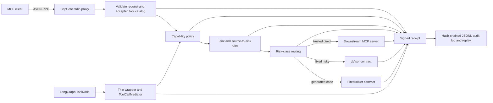

# CapGate

[](https://github.com/Devx228/interpose-deva/actions/workflows/ci.yml)

CapGate is a Python security mediator for AI-agent tool calls. Its primary surface is a hardened MCP
proxy, with a narrow real LangGraph integration that reuses the same framework-neutral engine. It
assumes an agent may be prompt-injected or otherwise compromised, then deterministically limits
what that agent can do through capability policy, information-flow labels, source-to-sink rules,
sandbox routing, and signed audit receipts.

> **Current scope:** v0.1 is a research prototype with locally verified controls. It is not a
> production security boundary. Representative AgentDojo ASR, adaptive robustness, and real Linux
> sandbox isolation are **not yet measured or established**.

## Why this exists

Prompt injection becomes dangerous when untrusted content can steer an agent that also has private
data and powerful tools. CapGate treats model output as untrusted control input. Authorization is
performed in ordinary code at the tool boundary instead of asking another model whether a prompt
looks malicious.

The design is grounded in capability security and information-flow-control work including
[AgentDojo](https://arxiv.org/abs/2406.13352),
[CaMeL](https://arxiv.org/abs/2503.18813),
[Fides](https://arxiv.org/abs/2505.23643), and
[Progent](https://arxiv.org/abs/2504.11703). Published results from those projects are research
context, not CapGate results.

## Architecture



Secure mode mediates `tools/list` and `tools/call`, forwards only a small allowlist of MCP control
methods, and blocks unmediated resource, prompt, sampling, and custom methods. See the exact trust
boundary and residual risks in the [security model](docs/SECURITY_MODEL.md).

## Run the offline security demo

This is the fastest way to evaluate the project. After dependencies are installed, demo execution
requires no API key, `.env`, network access, gVisor, or Firecracker.

```bash
python3 -m venv .venv
. .venv/bin/activate
python -m pip install -e .
python examples/offline_demo/run.py
```

The one-line JSON result proves, through the real CLI proxy path, that:

- `tools/list` and a private read are allowed;
- the private result is labeled secret and untrusted;
- a later external send is blocked by `flow.lethal_trifecta` before it reaches the server;
- three Ed25519-signed, hash-chained receipts replay successfully;
- the raw private marker is absent from the receipt log;
- a changed tool definition is blocked after restart by the persistent pin; and
- modifying a retained receipt makes replay fail signature verification.

The output explicitly labels itself as offline deterministic control validation—not AgentDojo ASR
or production-isolation evidence. All state is created in a temporary directory and removed.

## Run the LangGraph security demo

This second demo uses a real compiled `StateGraph` and real `ToolNode`, but a deterministic planner
instead of an LLM. It requires no model API key or network access:

```bash
python -m pip install -e ".[langgraph]"
python examples/langgraph_security_demo.py
```

It allows a harmless status call and a synthetic private read, then blocks the private,
untrusted-influenced value from reaching a synthetic external sink. The sink handler is never
called, the three signed receipts replay, and the raw marker is absent from the receipt log. The
adapter validates schema-coerced arguments against trusted caller-supplied labels and rejects
multi-call turns or state/store/runtime-injected tool arguments in this v0.1 slice.

## What is backed today

Local verification on 2026-07-04 used Python 3.14.5:

| Area | Evidence | Honest status |
|---|---|---|
| Capability and flow decisions | Policy, pipeline, exfiltration regression, and offline demo tests | Locally verified |
| MCP protocol boundary | Strict request/response shape and ID checks; accepted catalog required in secure mode | Locally verified |
| Tool poisoning/rug pull | SQLite first-seen pins survive proxy restart; changed definitions block | Locally verified with trust-on-first-use limits |
| Audit integrity | Exact receipt schemas, strict Ed25519 material, chaining, replay, tamper tests | Locally verified for retained logs |
| Egress, budgets, gVisor, Firecracker | Pure contracts and injected fake runners | Contract-tested only |
| Dual-model quarantine | Tool-less extractor and opaque-reference boundary | Unit-tested boundary only |
| LangGraph | Compiled `StateGraph`, real `ToolNode`, framework-neutral mediator, offline adversarial demo | Locally verified narrow synchronous slice |
| AgentDojo security performance | No representative paired run | **NOT YET MEASURED** |
| Adaptive robustness | Evidence validator only; no campaign | **NOT YET MEASURED** |

The current local suite passes **376 tests**, Ruff, and strict mypy. CI is configured to repeat the
checks on the minimum supported Python 3.11 and Python 3.14, then run both offline demos. No remote
workflow result is claimed here.

## Core security properties

- **Deny by default:** unknown tools, missing metadata, malformed messages, undiscovered tools,
  unmediated methods, and decision failures do not execute in secure mode.
- **Capability precedence:** explicit deny → approval required → explicit allow → default deny.
- **Monotonic provenance:** label joins cannot lower confidentiality, restore integrity, or remove
  source tags.
- **Source-to-sink containment:** private data with untrusted influence cannot reach configured
  external sinks.
- **No sandbox downgrade:** risky classes require their exact backend; missing or failed execution
  blocks rather than falling back to the host.
- **Payload-minimized audit:** receipts contain hashes and decision metadata, not raw arguments or
  results.

## Install for development

```bash
python3 -m venv .venv
. .venv/bin/activate
python -m pip install -e ".[dev,langgraph]"
```

Install the pinned, locally validated AgentDojo environment only when working on benchmark code:

```bash
python -m pip install -e ".[dev,bench,langgraph]"
```

Run all local checks:

```bash
ruff check .
mypy --strict src tests examples
pytest -q
python examples/offline_demo/run.py
python examples/langgraph_security_demo.py
```

## Run the proxy

Secure mode requires both a capability policy and tool-security metadata:

```bash
capgate proxy \
  --receipt-log .capgate/receipts.jsonl \
  --tool-pin-db .capgate/tool-pins.sqlite3 \
  --policy-file examples/offline_demo/policy.yaml \
  --tool-metadata-file examples/offline_demo/tool-metadata.yaml \
  --server-name my-mcp-server \
  --downstream python path/to/downstream_mcp_server.py
```

Every callable tool needs an explicit capability, result label, risk class, and sink classification:

```yaml
tools:
  search:
    capability: read:web
    confidentiality: public
    integrity: untrusted
    risk_class: trusted_direct
    source_tags: [untrusted_web]
    sink: none
```

Risk classes are `trusted_direct`, `fixed_risky`, and `generated_code`. A missing or unknown class
blocks. `fixed_risky` routes only to gVisor and `generated_code` only to Firecracker. The stock CLI
does not yet configure production sandbox executors, so risky calls block rather than downgrading.

Starting the proxy without policy and metadata keeps the Stage 0 pass-through path for debugging
and baseline measurement. That mode is not a security control.

## Replay receipts

```bash
capgate replay <session-id> \
  --receipt-log .capgate/receipts.jsonl \
  --public-key-file .capgate/ed25519.public
```

Replay verifies receipt sequence, previous hashes, version-specific schemas, and signatures. It
detects mutation of retained entries; without an external anchor it cannot prove that a log tail was
not deleted or that both the log and key were not replaced.

## AgentDojo evaluation

The fully offline ground-truth path checks benchmark wiring and receipt coverage, not attack
resistance:

```bash
python bench/agentdojo_runner.py \
  --mode capgate \
  --enforcement stage1 \
  --pipeline ground-truth \
  --attack none \
  --suite workspace \
  --benchmark-version v1.2.2 \
  --user-task user_task_0 \
  --force-rerun \
  --out /tmp/capgate-groundtruth.json
```

External-model runs read credentials only in the AgentDojo model path. Put them in an untracked
`.env` using `.env.example`; never commit the file. Reports record the exact command, AgentDojo
version, and a Git revision only when the nonignored Git worktree is clean. Ignored local files and
the wider run environment are not captured. See the
[report validity manifest](bench/reports/README.md) before quoting any number.

## Learn and review the project

- [Complete project guide](PROJECT_GUIDE.md) — beginner-first architecture, code map, lifecycle,
  controls, demos, extension guide, debugging, roadmap, glossary, and interview walkthrough.
- [AI-agent security learning path](docs/LEARNING_PATH.md) — nine code-linked modules, exercises,
  mastery questions, and an interview teach-back.
- [Security model](docs/SECURITY_MODEL.md) — assets, attacker, TCB, invariants, claim matrix, and
  residual risks.
- [Current build status](STATUS.md) — real implementation, measurement blockers, and next steps.
- [Stage 1 taint design](spec-docs/STAGE1_TAINT_DESIGN.md) and
  [Stage 2 isolation design](docs/design-notes/STAGE2_ISOLATION.md).
- [Security reporting policy](SECURITY.md).

## Explicit nonclaims

CapGate does not currently claim:

- prompt-injection prevention or model alignment;
- representative AgentDojo ASR reduction or utility preservation;
- robustness under adaptive attack;
- real process, filesystem, syscall, network, or VM isolation;
- a production sandbox runner or egress broker;
- a live dual-model provider flow;
- LangGraph compatibility beyond the tested synchronous `ToolMessage` slice, or working OpenAI
  Agents SDK and Pydantic AI integrations; or
- production readiness or formally proven end-to-end security.

## License

No license has been selected yet. Do not assume permission to copy, modify, or redistribute this
repository until the owner chooses and adds one.
